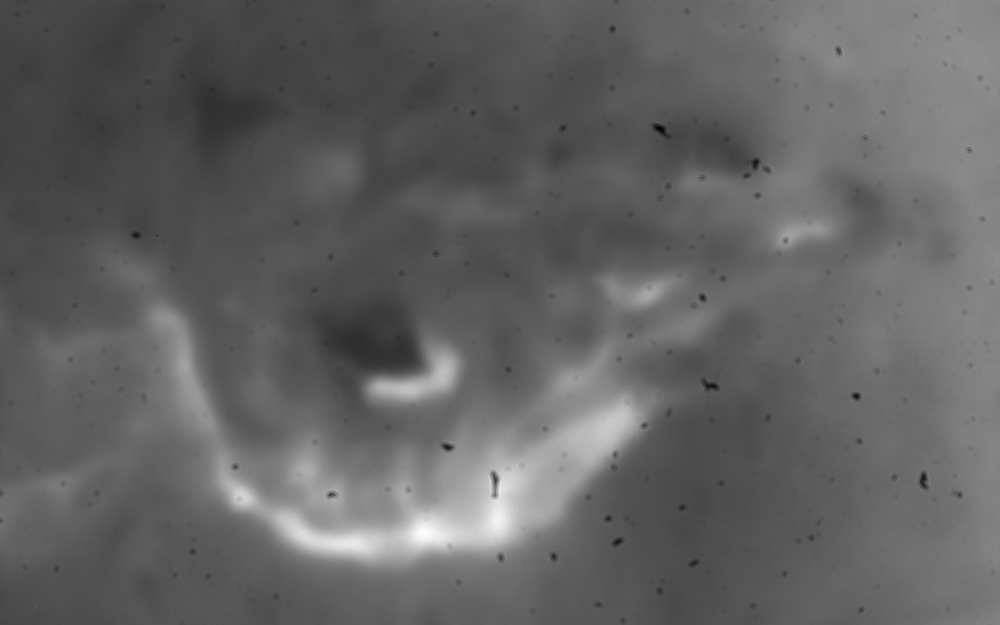
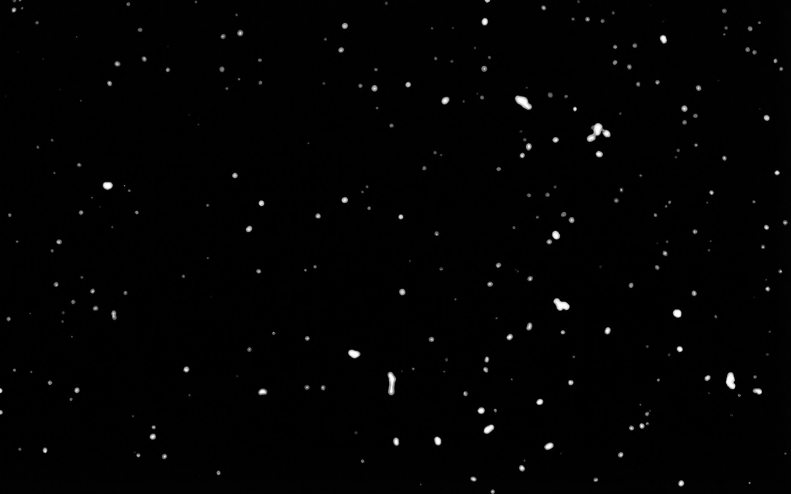

# AI 平场校准工具 (AI-FlatField)

[English version](./README_en.md) | [**原理详解 (Blog Post)**](https://yage.ai/ai-flat-field.html)

这是一个专门为天文摄影设计的传感器灰尘自动检测与平场校准工具。它结合了 Google Gemini AI (Nano Banana Pro) 的视觉理解能力与严谨的数学平场校准算法，解决了在极端拍摄条件下（如大焦比日面摄影）灰尘难以去除的痛点。

## 核心理念：AI 的“眼”与传统算法的“手”

在处理传感器灰尘时，我们经常面临一个矛盾：
*   **传统算法（如 KLL）**：从物理规则出发，足够安全但“眼瞎”，在视宁度不佳或目标细节丰富时，难以分辨什么是灰尘，什么是目标。
*   **端到端 AI 生图**：视觉理解力极强，校准效果“眼尖”但“手滑”，容易在修图时随手添加不存在的纹理或改变局部亮度，破坏了数据的科学性。

**本项目的设计哲学是将二者结合：利用 AI 作为“眼”来精准定位灰尘并推测被遮挡的信号；利用数学公式作为“手”来执行最终的像素校准，并严格限制校准范围。**

## 算法流程

本项目采用了一套“AI 生成中间件 + 传统算法执行”的混合工作流：

1.  **时域中值提取**: 从视频流（SER文件）中提取所有帧并计算中位数。虽然这能分离部分灰尘，但往往会残留目标的低频结构。
2.  **AI 精准定位 (The Eye)**: 将中值图发送给 Gemini (Nano Banana Pro)，让 AI 以超越人类手工标注的精度生成灰尘遮罩 (Mask)。这个遮罩本身就具有巨大的科研价值，可用于数据剔除。
3.  **AI 信号推理 (Inpainting)**: 利用 AI 的上下文理解能力，对遮罩区域进行修复 (Inpainting)，推测如果没有灰尘，该处的理想响应应该是怎样的。
4.  **合成平场生成 (The Hand)**: 这是保证科学性的关键。我们不直接使用 AI 生成的图像，而是通过公式合成一张“合成平场”：
    `final_flatfield = (1 - mask) * 1.0 + mask * (median_flatfield / inpainted)`
    *   在**非灰尘区域**，校正因子严格等于 **1.0**，保证原始信号 100% 完美保留，没有任何 AI 幻觉的干扰。
    *   在**灰尘区域**，利用 AI 推理的比例进行补偿。
5.  **直方图匹配与一致性**: 在合成前进行直方图匹配，消除 AI 生成过程中产生的全局亮度偏移。

## 结果展示

| 原始中值平场 | AI 灰尘检测遮罩 |
| :---: | :---: |
|  |  |
| **AI 修复结果 (信号推测)** | **最终合成平场 (16-bit TIFF)** |
|  |  |

## 使用方法

### 1. 环境准备

推荐使用 [uv](https://github.com/astral-sh/uv) 管理环境。安装依赖：

```bash
pip install -r requirements.txt
```

### 2. 配置 API Key

在项目根目录下创建 `.env` 文件，填入你的 Google Gemini API Key：

```bash
GEMINI_API_KEY=你的_GEMINI_API_KEY
```
*(获取地址: [Google AI Studio](https://aistudio.google.com/app/apikey))*

### 3. 运行程序

将 `.ser` 文件放入目录并运行：

```bash
python main.py --input your_file.ser
```

程序将以向导模式运行，你可以在每个阶段预览并确认 AI 的处理结果。如果 AI 在某次推理中表现不佳，按 **'R'** 键即可重新“抽卡”。

### 4. 在 PixInsight 中校准

生成的 `final_flatfield.tiff` 是 16 位格式（65535 对应 1.0）。你可以：
*   在 **PixelMath** 中使用 `$T / final_flatfield` 直接校准。
*   在 **Image Calibration** 过程中将其选为 Flat Field 文件：
    

## 项目结构

*   `main.py`: 交互流程管理。
*   `gemini_client.py`: 封装 Gemini (Nano Banana Pro) 的检测与修复逻辑。
*   `flatfield.py`: 核心数学运算（中值计算、合成平场合成、直方图匹配）。
*   `ser_reader.py`: SER 文件高效读取。
*   `mask_processing.py`: 遮罩的膨胀与模糊处理。

## 深度阅读

关于本项目背后的思考、对比实验以及为何这种模式是科学摄影的未来，请阅读博客文章：
👉 [**使用AI生图助力天文学观测摄影**](https://yage.ai/ai-flat-field.html)
